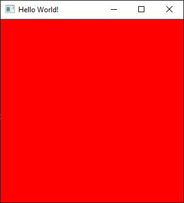

# lwjgl3-helloworld demo + GraalVM native image

HelloWorld [demo](https://www.lwjgl.org/guide) for LWJGL 3,
compiled to native executable by GraalVM native-image utility.

	

Gradle/Maven wrappers & build scripts are provided for building the project,
which requires JDK 11+ or GraalVM 21+ (for native image).

## GraalVM pre-requisites

The [GraalVM native-image](https://www.graalvm.org/reference-manual/native-image) page
shows how to set up GraalVM and its native-image utility for common platforms.
[Gluon](https://gluonhq.com/) also provides some setup
[details](https://docs.gluonhq.com/#_platforms) for GraalVM native-image creation.

This project's Gradle build script uses the
[client-gradle-plugin](https://github.com/gluonhq/client-gradle-plugin)
from Gluon to build the native executable from Gradle with GraalVM.

The GraalVM native-image utility will use the configuration files in
`src/main/resources/META-INF/native-image` folder to assist in the native-image generation.

Gluon also provides the [client-maven-plugin](https://github.com/gluonhq/client-maven-plugin)
which is used in this project's Maven build script and works similarly to the above
client-gradle-plugin.

## Gradle build tasks

To build and run the HelloWorld demo in standard JVM with Gradle, execute the `run` task:

	gradlew run

To see some debug info generated by LWJGL, run it with relevant system properties
to show some debug messages in the console:

	gradlew run -Dorg.lwjgl.util.Debug=true

The above tasks can use any standard JDK 11+.

To generate native executable, GraalVM 21+ need be set up as mentioned in
*GraalVM pre-requisites* section above.

Once GraalVM is set up and available in the path, run the `nativeBuild` task:

	gradlew nativeBuild

The `nativeBuild` task would take a while to compile the demo source code and
link them with the LWJGL libraries into an executable file.
The resulting `lwjgl3-helloworld` executable file is:

	build/client/x86_64-linux/lwjgl3-helloworld

(or if building on a Windows machine:

	build\client\x86_64-windows\lwjgl3-helloworld.exe

)

which can then be run directly:

	./build/client/x86_64-linux/lwjgl3-helloworld

or, run it with relevant system properties to see some debug info in the console:

	./build/client/x86_64-linux/lwjgl3-helloworld -Dorg.lwjgl.util.Debug=true

(or if building on a Windows machine:

	build\client\x86_64-windows\lwjgl3-helloworld.exe
	build\client\x86_64-windows\lwjgl3-helloworld.exe -Dorg.lwjgl.util.Debug=true

)

## Maven build tasks

To build and run the HelloWorld demo in standard JVM with Maven, execute the
`compile` then `exec:exec` tasks:

	mvnw compile
	mvnw exec:exec

To see some debug info generated by LWJGL, run it with relevant system properties
to show some debug messages in the console:

	mvnw exec:exec -Dsys.props="-Dorg.lwjgl.util.Debug=true"

The above tasks can use any standard JDK 11+.

To generate native executable, GraalVM 21+ need be set up as mentioned in
*GraalVM pre-requisites* section above.

Once GraalVM is set up and available in the path, run the `client:build` task:

	mvnw client:build

The `client:build` task would take a while to compile the demo source code and
link them with the LWJGL libraries into an executable file.
The resulting `lwjgl3-helloworld` executable file is:

	target/client/x86_64-linux/lwjgl3-helloworld

(or if building on a Windows machine:

	target\client\x86_64-windows\lwjgl3-helloworld.exe

)

which can then be run directly:

	./target/client/x86_64-linux/lwjgl3-helloworld

or, run it with relevant system properties to see some debug info in the console:

	./target/client/x86_64-linux/lwjgl3-helloworld -Dorg.lwjgl.util.Debug=true

(or if building on a Windows machine:

	target\client\x86_64-windows\lwjgl3-helloworld.exe
	target\client\x86_64-windows\lwjgl3-helloworld.exe -Dorg.lwjgl.util.Debug=true

)

## Compressed native executable

The resulting `lwjgl3-helloworld` executable file, whether produced by Gradle or Maven build script,
can be further reduced in size via compression using the [UPX](https://upx.github.io) utility,
as described [here](https://medium.com/graalvm/compressed-graalvm-native-images-4d233766a214).

For example, the resulting `lwjgl3-helloworld.exe` native application file produced in Windows
is normally 58MB in size, but is compressed to 15MB with the UPX command: `upx --best lwjgl3-helloworld.exe`

